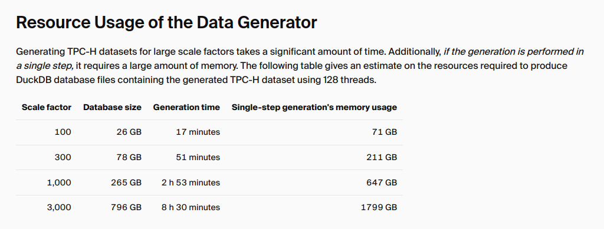

# Capstone-NLUS-VDD
Natural Language Understanding System for Voice-Based Data Discovery in Data WareHouse
### Vietnamese
Hệ thống NLU-VDD là một nền tảng tích hợp công nghệ nhận dạng giọng nói (ASR), xử lý ngôn ngữ tự nhiên (NLP), và máy học (ML) để cho phép người dùng truy vấn dữ liệu từ Data Lake thông qua giao diện tự nhiên bằng giọng nói, mà không cần kiến thức về SQL hoặc cơ sở dữ liệu. Một trong những ứng dụng chính là có thể giúp đỡ các tư vấn viên và sales trong việc truy cập và tìm kiếm thông tin của sản phẩm và chăm sóc khách hàng.

### Case Study:
Sử dụng tập dữ liệu TPC-DS từ DuckDB (phiên bản sf100 với kích thước khoảng 26GB) để huấn luyện mô hình và minh họa khả năng truy vấn dữ liệu bằng giọng nói. Team chúng tôi cũng tự xây dựng và tổng hợp dữ liệu về sản phẩm và khách hàng với ngôn ngữ tiếng Việt để phù hợp với người Việt Nam.

### Tập dữ liệu:
- Tập dữ liệu DuckDB: [TPC-H Benchmark](https://duckdb.org/docs/stable/core_extensions/tpch)

#### Về kích thước của DuckDB:
TPC-DS có kích thước xấp xỉ TPC-H:

### Giải pháp kỹ thuật:
#### Về mặt AI/ML:
- Sử dụng mô hình nhận dạng giọng nói (ASR) để chuyển đổi giọng nói thành văn bản.
- Sử dụng mô hình xử lý ngôn ngữ tự nhiên (NLP) để phân tích và hiểu ý định của người dùng từ văn bản.
- Sử dụng mô hình máy học (ML) để chuyển đổi ý định của người dùng thành các truy vấn SQL tương ứng.
- Kết nối và truy vấn dữ liệu từ Data Lake sử dụng các công cụ như DuckDB và SQL Server.
- Trả về kết quả truy vấn cho người dùng

#### Về mặt software:
- Sử dụng Python để xây dựng các mô hình ASR, NLP, và ML và tích hợp chúng vào hệ thống NLU-VDD, Trino và MinIO để xây dựng server lưu trữ và execute các query SQL.
- Sử dụng DuckDB như một hệ quản trị cơ sở dữ liệu quan hệ (RDBMS) để lưu trữ và truy vấn dữ liệu TPC-H.
- Các mô hình sử dụng:
    - ASR: OpenAI/Whisper, Vinai/Phowhiser, Chunkformer
    - Text to SQL: Ellbendls/Qwen-3-4b-Text_to_SQL-GGUF
- Framework Finetune: peft, transformers, trl
### System design:
- Luồng chính: user -> Server 1 [ASR -> NLP -> Text to SQL] -> Server 2 [Storage and Execute SQL] -> Result -> UI
