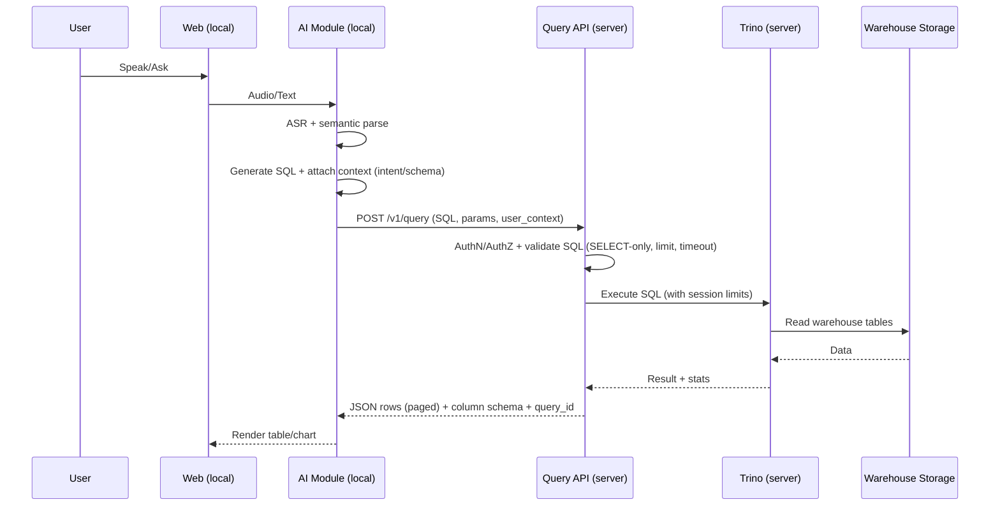

# System Design — NLU‑VDD (Web + AI local, Query warehouse qua API server)

## 1) Mục tiêu & phạm vi
Bạn chạy:
- **Máy cá nhân**: host Web UI + AI module (voice → SQL).
- **Server**: host **Data Warehouse** + **Query API** để nhận SQL, chạy query và trả kết quả về Web.

Mục tiêu:
- Người dùng nói/nhập câu hỏi → AI sinh SQL (đã kiểm soát) → server thực thi trên DW → trả kết quả dạng JSON/CSV.
- Tách “nặng” (data + compute) sang server; laptop chỉ xử lý giao diện + mô hình AI.
- Kênh kết nối **an toàn** giữa máy cá nhân và server.

Ngoài phạm vi (có thể làm sau):
- Multi-tenant phức tạp, streaming real-time, governance doanh nghiệp đầy đủ.

## 2) Kiến trúc tổng thể (high-level)
Kiến trúc theo mô hình “client (máy cá nhân) ↔ server (DW)”:

```text
User
  |
  | Voice/Text
  v
Web UI (local)  --->  AI Module (local: ASR/NLU/Text-to-SQL)
                            |
                            | HTTPS (khuyến nghị mTLS/WireGuard)
                            v
                     Query API (server)
                            |
                            | validate/policy/rewrite (guardrails)
                            v
                    Trino (server, query engine)
                            |
                            v
            Data Warehouse (server: STG/DIM/FACT/MART)
                            ^
                            |
                     Results (JSON paged + metadata)
                            |
                            v
                     Web UI (local)
```

Nếu môi trường của bạn có hỗ trợ Mermaid, có thể xem sơ đồ Mermaid ở khối bên dưới.

<details>
<summary>Mermaid diagram (optional)</summary>

```mermaid
flowchart LR
  U[User] -->|Voice/Text| WEB[Web UI\n(Local machine)]
  WEB --> AI[AI Module\nASR+NLU+Text-to-SQL\n(Local machine)]
  AI -->|HTTPS/mTLS| API[Query API\n(Server)]
  API --> GR[SQL Guardrails\nValidate/Policy/Rewrite]
  GR --> QE[Query Engine\nTrino (khuyến nghị)]
  QE --> DW[(Data Warehouse\nDIM/FACT/MART)]
  API -->|JSON (paged)\n+ metadata| WEB
```

</details>

Ý tưởng chính: **server không tin** SQL từ client. Server luôn validate/policy trước khi chạy.

## 3) Luồng xử lý (sequence)
Luồng xử lý chuẩn (sync) theo từng bước:
1) User nói/nhập câu hỏi trên Web.
2) Web gửi audio/text cho AI module (local).
3) AI module chạy ASR/NLU và sinh SQL (kèm context nếu có).
4) AI module gọi server: `POST /v1/query` (HTTPS) gửi SQL + tham số + user_context.
5) Query API trên server xác thực (AuthN/AuthZ), áp policy, validate SQL (SELECT-only, LIMIT, timeout, whitelist schema).
6) Query API gửi SQL sang Trino để thực thi (kèm session limits).
7) Trino đọc bảng trong Data Warehouse và trả kết quả + thống kê (rows, bytes scanned, elapsed).
8) Query API trả về client: dữ liệu dạng JSON (phân trang) + metadata + `query_id`.
9) Web render bảng/biểu đồ.

Nếu môi trường của bạn có hỗ trợ Mermaid, có thể xem sequence Mermaid ở khối bên dưới.

<details>
<summary>Mermaid sequence (optional)</summary>



</details>

## 4) Server: Data Warehouse (Apache-first)
### 4.1 Compute/query engine
Khuyến nghị **Trino** cho truy vấn interactive (BI/analytics, latency tốt).
- Trino đọc dữ liệu từ warehouse tables.
- Spark dùng cho ETL (build/refresh DIM/FACT/MART).

Tuỳ chọn:
- Hive (thay/đi kèm Trino) nếu bạn quen hệ Hive.
- Apache Doris nếu cần serving OLAP cực nhanh (dashboard), nhưng tăng độ phức tạp vận hành.

### 4.2 Storage/table format
Trọng tâm là **mô hình dữ liệu DIM/FACT**; table format phụ thuộc storage:
- Nếu warehouse nằm trên filesystem (HDFS/local `/data`): Parquet/ORC + Hive Metastore.
- Nếu muốn S3-compatible (free): chạy **MinIO** trên server, lưu Parquet và quản lý table bằng **Iceberg** (để có ACID/schema evolution). Trino + Spark hỗ trợ tốt.

### 4.3 Data modeling (warehouse-first)
Chia vùng:
- **STG**: nạp dữ liệu thô theo batch.
- **CORE DW**: DIM/FACT (star schema), conformed dimensions, SCD (tuỳ dim).
- **MART/Serving**: aggregates/materialized views phục vụ câu hỏi hay gặp.

## 5) Server: Query API (thành phần bắt buộc)
### 5.1 Vai trò
Query API là “cổng an toàn”:
- Nhận SQL từ máy cá nhân.
- Xác thực & phân quyền.
- Validate/rewriting SQL theo policy.
- Gọi Trino/Hive để chạy query.
- Trả kết quả dạng paginated JSON + query stats (rows, bytes scanned, elapsed).

### 5.2 API contract gợi ý (MVP)
- `POST /v1/query`
  - input: `{ sql, parameters?, limit?, timeout_ms?, request_id? }`
  - output: `{ query_id, columns, rows, next_page_token?, stats }`
- `GET /v1/query/{query_id}`
  - lấy trạng thái (running/succeeded/failed) nếu chạy async
- `GET /v1/query/{query_id}/page?page_token=...`
  - phân trang kết quả lớn

## 6) Guardrails bắt buộc (server-side)
Không dựa vào việc AI “tự cẩn thận”.
- Parse SQL (vd `sqlglot`) và enforce:
  - Chỉ `SELECT` (deny DDL/DML).
  - Bắt buộc `LIMIT` (vd 1k/10k tuỳ use-case).
  - Timeout cứng (vd 30–120s).
  - Chặn `SELECT *` trên bảng lớn (tuỳ policy).
  - Whitelist schema/catalog (chỉ cho phép truy cập dataset hợp lệ).
- Tách quyền theo user/role:
  - Trino: dùng views, hoặc external authorization (tuỳ mức độ).
- Audit log:
  - Lưu `user_id`, `sql_hash`, `query_id`, `elapsed`, `bytes_scanned`, `status`.

## 7) Bảo mật liên kết giữa máy cá nhân và server
Khuyến nghị theo thứ tự ưu tiên (MVP → tốt hơn):

### 7.1 Kênh truyền
- **HTTPS bắt buộc** (TLS).
- Tốt nhất: **mTLS** (client certificate) để server xác thực đúng máy cá nhân.
- Hoặc dùng **WireGuard VPN**: máy cá nhân và server nói chuyện qua private IP, giảm bề mặt tấn công.
- Trường hợp đơn giản: SSH tunnel (port-forward) cho demo.

### 7.2 AuthN/AuthZ
- Token-based: JWT hoặc API key (ít nhất).
- Nên có: rotate key, expiry, revoke.
- IP allowlist (nếu IP client cố định) + rate limit.

### 7.3 Hardening
- Query API không public toàn bộ: chỉ mở port cần thiết, firewall/ufw.
- Không expose Trino/Hive public Internet; chỉ cho Query API truy cập.
- Secrets không hard-code; dùng env/secret store.

## 8) Sizing & cấu hình theo server hiện có
Server bạn cung cấp:
- CPU: 2× Intel Xeon Gold 6138, 40 cores vật lý (80 threads).
- RAM: ~251Gi.
- Disk: `/` NVMe gần đầy; `/data` còn ~5TB trống (nên dùng cho DW và scratch).

Khuyến nghị layout:
- Warehouse data: `/data/warehouse`
- Spark temp: `/data/spark_tmp`
- Trino spill (nếu bật): `/data/trino_spill`
- Logs: `/data/logs`

Spark ETL (điểm khởi đầu):
- `--conf spark.local.dir=/data/spark_tmp`
- `--conf spark.sql.adaptive.enabled=true`
- `--conf spark.sql.shuffle.partitions=256`
- Executor sizing (tuỳ framework chạy Spark):
  - `--num-executors 8`
  - `--executor-cores 8`
  - `--executor-memory 20g`
  - `--conf spark.executor.memoryOverhead=3g`

Trino (mức cơ bản):
- Giới hạn memory/query để tránh “ăn hết RAM”.
- Bật spill ra `/data/trino_spill` cho join/agg lớn (tuỳ workload).

## 9) Lộ trình triển khai (phù hợp mô hình client↔server)
1) Dựng DW stack trên server: Hive Metastore + Trino + Spark ETL; dữ liệu đặt trên `/data`.
2) Xây Query API (server) + guardrails (SELECT-only, limit, timeout, whitelist).
3) Trên máy cá nhân: Web + AI module (speech→SQL) gọi Query API và render kết quả.
4) Bổ sung bảo mật nâng cao: mTLS hoặc WireGuard; audit log + rate limit.
5) Tối ưu: MART/materialized views + cache kết quả; async query/pagination.
