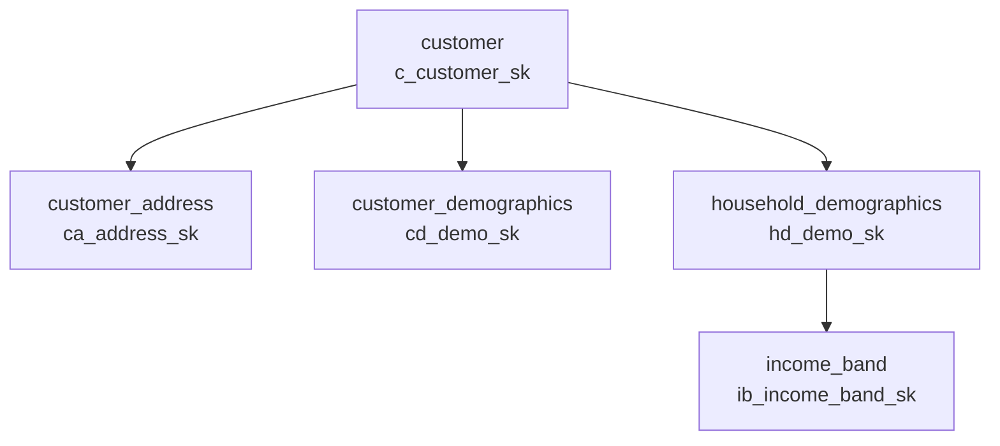
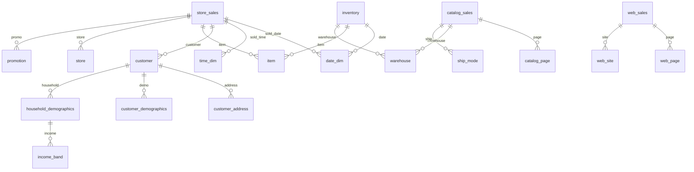

# TPC-DS Snowflake Schema - Tài liệu Học tập

## Mục lục
1. [Giới thiệu TPC-DS](#1-giới-thiệu-tpc-ds)
2. [Star Schema vs Snowflake Schema](#2-star-schema-vs-snowflake-schema)
3. [Cấu trúc TPC-DS Snowflake Schema](#3-cấu-trúc-tpc-ds-snowflake-schema)
4. [Parquet Format](#4-parquet-format)
5. [DuckDB Extension](#5-duckdb-extension)
6. [Hướng dẫn sử dụng Scripts](#6-hướng-dẫn-sử-dụng-scripts)
7. [Tích hợp với MinIO/Trino](#7-tích-hợp-với-miniotrino)

---

## 1. Giới thiệu TPC-DS

### TPC-DS là gì?
**TPC-DS** (Transaction Processing Performance Council - Decision Support) là một benchmark chuẩn công nghiệp để đánh giá hiệu năng của hệ thống Decision Support (Data Warehouse).

### Đặc điểm:
- **Domain**: E-commerce/Retail (bán lẻ)
- **Scale Factor**: Từ 1GB đến 100TB
- **25 bảng** mô phỏng hoạt động của công ty bán lẻ qua 3 kênh:
  - 🏪 Store (cửa hàng)
  - 📚 Catalog (catalog mail order)
  - 🌐 Web (bán online)

### Tại sao chọn TPC-DS?
```
✅ Chuẩn công nghiệp, được benchmark bởi các vendor lớn
✅ Schema phức tạp, phù hợp test Text-to-SQL
✅ Có sẵn trong DuckDB extension
✅ Dữ liệu realistic cho e-commerce
```

---

## 2. Star Schema vs Snowflake Schema

### Star Schema (Sơ đồ Ngôi sao)
```
                    ┌──────────┐
                    │   DIM    │
                    │ Customer │
                    └────┬─────┘
                         │
    ┌──────────┐    ┌────┴────┐    ┌──────────┐
    │   DIM    │────│  FACT   │────│   DIM    │
    │   Date   │    │  Sales  │    │   Item   │
    └──────────┘    └────┬────┘    └──────────┘
                         │
                    ┌────┴─────┐
                    │   DIM    │
                    │   Store  │
                    └──────────┘
```
- Dimension tables **denormalized** (một bảng chứa tất cả attributes)
- Query **đơn giản hơn** (ít JOINs)
- **Tốn không gian** do trùng lặp dữ liệu

### Snowflake Schema (Sơ đồ Bông tuyết)
```
    ┌───────────┐
    │  Income   │
    │   Band    │
    └─────┬─────┘
          │
    ┌─────┴─────┐          ┌──────────┐
    │ Household │          │ Customer │
    │   Demo    │          │ Address  │
    └─────┬─────┘          └────┬─────┘
          │                     │
          └────────┬────────────┘
                   │
              ┌────┴────┐
              │ Customer│
              └────┬────┘
                   │
              ┌────┴────┐
              │  FACT   │
              │  Sales  │
              └─────────┘
```
- Dimension tables **normalized** (chia nhỏ thành nhiều bảng liên quan)
- **Tiết kiệm không gian**
- Query **phức tạp hơn** (nhiều JOINs)
- **Dễ maintain** khi update dimension data

### Khi nào dùng Snowflake?
- Dimension data thay đổi thường xuyên
- Cần tiết kiệm storage
- Có các sub-dimension rõ ràng (vd: Customer → Address → City → Country)

---

## 3. Cấu trúc TPC-DS Snowflake Schema

### 3.1 Fact Tables (7 bảng)

Fact tables chứa **metrics/measures** và **foreign keys** đến dimensions.

| Fact Table | Mô tả | Grain (Độ chi tiết) |
|------------|-------|---------------------|
| `store_sales` | Bán tại cửa hàng | 1 row = 1 line item |
| `store_returns` | Trả hàng tại cửa hàng | 1 row = 1 line item trả |
| `catalog_sales` | Bán qua catalog | 1 row = 1 line item |
| `catalog_returns` | Trả từ catalog | 1 row = 1 line item trả |
| `web_sales` | Bán online | 1 row = 1 line item |
| `web_returns` | Trả từ online | 1 row = 1 line item trả |
| `inventory` | Tồn kho | 1 row = 1 item tại 1 warehouse vào 1 ngày |

### 3.2 Dimension Tables (18 bảng)

#### Core Dimensions
| Dimension | Mô tả | PK Column |
|-----------|-------|-----------|
| `date_dim` | Ngày (role-playing) | `d_date_sk` |
| `time_dim` | Thời gian trong ngày | `t_time_sk` |
| `item` | Sản phẩm | `i_item_sk` |

#### Customer Hierarchy (Snowflake!)


#### Channel Dimensions
| Dimension | Channel | Mô tả |
|-----------|---------|-------|
| `store` | Store | Cửa hàng vật lý |
| `catalog_page` | Catalog | Trang trong catalog |
| `web_page` | Web | Trang web |
| `web_site` | Web | Website |
| `call_center` | All | Trung tâm CSKH |

#### Operational Dimensions
| Dimension | Mô tả |
|-----------|-------|
| `warehouse` | Kho hàng |
| `ship_mode` | Phương thức ship |
| `promotion` | Khuyến mãi |
| `reason` | Lý do trả hàng |

### 3.3 Entity Relationship Diagram



---

## 4. Parquet Format

### Parquet là gì?
**Apache Parquet** là columnar storage format, tối ưu cho analytics workloads.

### So sánh với CSV
| Feature | CSV | Parquet |
|---------|-----|---------|
| Format | Row-based | Column-based |
| Compression | Không | SNAPPY/ZSTD/GZIP |
| Schema | Không | Có metadata |
| Nested data | Không | Có |
| Read performance | Chậm | Nhanh (predicate pushdown) |

### Tại sao dùng Parquet cho Data Warehouse?
```
✅ Columnar format → chỉ đọc columns cần thiết
✅ Compression hiệu quả (giảm 80-90% so với CSV)
✅ Schema enforcement
✅ Hỗ trợ bởi Spark, Trino, DuckDB, PyArrow...
✅ Phù hợp với object storage (S3, MinIO)
```

### Compression Options
```python
# SNAPPY: nhanh, compression ratio trung bình
COPY table TO 'file.parquet' (COMPRESSION 'SNAPPY')

# ZSTD: chậm hơn, compression ratio cao hơn
COPY table TO 'file.parquet' (COMPRESSION 'ZSTD')

# GZIP: tương thích tốt, chậm nhất
COPY table TO 'file.parquet' (COMPRESSION 'GZIP')
```

---

## 5. DuckDB Extension

### TPC-DS Extension
DuckDB cung cấp extension để generate dữ liệu TPC-DS.

```sql
-- Cài đặt extension
INSTALL tpcds;
LOAD tpcds;

-- Generate dữ liệu với Scale Factor = 1 (1GB)
CALL dsdgen(sf=1);

-- Kiểm tra các bảng đã tạo
SHOW TABLES;

-- Query mẫu
SELECT COUNT(*) FROM store_sales;
```

### Scale Factor
| SF | Approximate Size | store_sales rows |
|----|------------------|------------------|
| 1 | ~1 GB | ~2.9 million |
| 10 | ~10 GB | ~29 million |
| 100 | ~100 GB | ~290 million |

### Export to Parquet
```sql
-- Export một bảng
COPY store_sales TO 'store_sales.parquet' 
(FORMAT PARQUET, COMPRESSION 'ZSTD');

-- Export với partitioning (cho bảng lớn)
COPY store_sales TO 'store_sales' 
(FORMAT PARQUET, PARTITION_BY (ss_sold_date_sk), COMPRESSION 'ZSTD');
```

---

## 6. Hướng dẫn sử dụng Scripts

### 6.1 Generate Parquet Files

```bash
# Di chuyển vào thư mục
cd /home/domt111/Capstone-NLUS-VDD/tpcds_warehouse

# Chạy script generate
python generate_parquet_tpcds.py
```

**Output:**
```
tpcds_sf1/
├── fact/
│   ├── store_sales.parquet
│   ├── store_returns.parquet
│   ├── catalog_sales.parquet
│   ├── catalog_returns.parquet
│   ├── web_sales.parquet
│   ├── web_returns.parquet
│   └── inventory.parquet
├── dim/
│   ├── customer.parquet
│   ├── customer_address.parquet
│   ├── customer_demographics.parquet
│   ├── ... (15 more files)
└── metadata/
    └── schema_info.json
```

### 6.2 Validate Export

```bash
python validate_parquet.py
```

**Validation checks:**
- ✅ File existence
- ✅ Schema matching
- ✅ Row count accuracy
- ✅ Foreign key integrity
- ✅ Data readability

### 6.3 Query Parquet với DuckDB

```bash
# Interactive DuckDB shell
duckdb

# Query trực tiếp từ Parquet
SELECT 
    i.i_item_id,
    i.i_item_desc,
    SUM(ss.ss_sales_price) as total_sales
FROM 'tpcds_sf1/fact/store_sales.parquet' ss
JOIN 'tpcds_sf1/dim/item.parquet' i 
    ON ss.ss_item_sk = i.i_item_sk
GROUP BY i.i_item_id, i.i_item_desc
ORDER BY total_sales DESC
LIMIT 10;
```

---

## 7. Tích hợp với MinIO/Trino

### Bước tiếp theo (Phase 2)


### MinIO Setup (sẽ làm ở phase sau)
```bash
# Start MinIO container
docker run -d \
  -p 9000:9000 \
  -p 9001:9001 \
  --name minio \
  -e MINIO_ROOT_USER=admin \
  -e MINIO_ROOT_PASSWORD=password \
  minio/minio server /data --console-address ":9001"

# Upload Parquet files
mc alias set local http://localhost:9000 admin password
mc mb local/tpcds
mc cp --recursive tpcds_sf1/ local/tpcds/
```

### Trino Configuration (sẽ làm ở phase sau)
```properties
# catalog/hive.properties
connector.name=hive
hive.metastore.uri=thrift://localhost:9083
hive.s3.endpoint=http://localhost:9000
hive.s3.aws-access-key=admin
hive.s3.aws-secret-key=password
hive.s3.path-style-access=true
```

---

## Tài liệu tham khảo

1. [TPC-DS Specification](http://www.tpc.org/tpcds/)
2. [DuckDB TPC-DS Extension](https://duckdb.org/docs/extensions/tpcds.html)
3. [Apache Parquet Documentation](https://parquet.apache.org/docs/)
4. [Data Warehouse Toolkit - Kimball](https://www.kimballgroup.com/data-warehouse-business-intelligence-resources/books/)
5. [MinIO Quickstart](https://min.io/docs/minio/linux/index.html)
6. [Trino Hive Connector](https://trino.io/docs/current/connector/hive.html)

---

## Quick Reference

### Các lệnh thường dùng

```bash
# Generate data
python generate_parquet_tpcds.py

# Validate
python validate_parquet.py

# Query với DuckDB CLI
duckdb -c "SELECT COUNT(*) FROM 'tpcds_sf1/fact/store_sales.parquet'"

# Xem schema
duckdb -c "DESCRIBE SELECT * FROM 'tpcds_sf1/dim/customer.parquet'"

# Xem file size
du -sh tpcds_sf1/fact/*.parquet
```

### Fact table row counts (SF=1)
| Table | ~Rows |
|-------|-------|
| store_sales | 2.9M |
| catalog_sales | 1.4M |
| web_sales | 720K |
| inventory | 11.7M |
